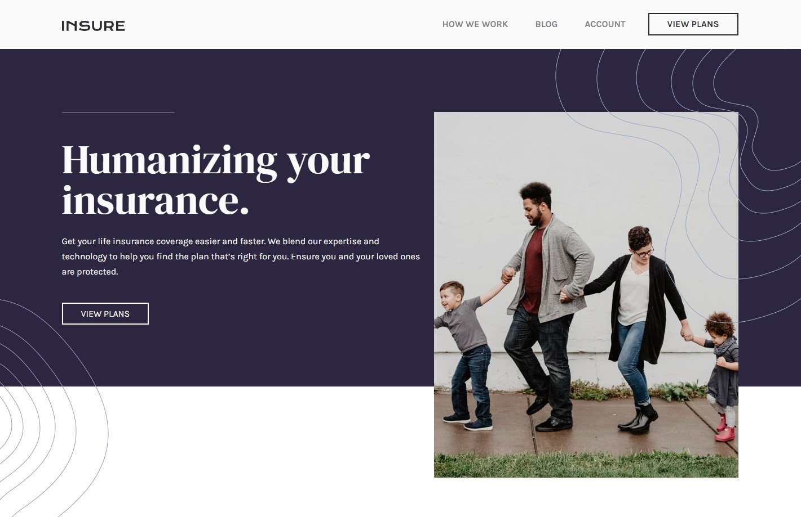

# Frontend Mentor - Insure landing page solution

This is a solution to the [Insure landing page challenge on Frontend Mentor](https://www.frontendmentor.io/challenges/insure-landing-page-uTU68JV8).

## Table of contents

- [Overview](#overview)
  - [The challenge](#the-challenge)
  - [Screenshot](#screenshot)
  - [Links](#links)
- [My process](#my-process)
  - [Built with](#built-with)
- [Author](#author)

## Overview

### The challenge

Users should be able to:

- View the optimal layout for the site depending on their device's screen size
- See hover states for all interactive elements on the page

### Screenshot

### Links

- Solution URL: [Solution](https://github.com/Grathienbeto/insure)
- Live Site URL: [Live site](https://your-live-site-url.com)

## My process

### Built with

- Semantic HTML5 markup
- CSS custom properties
- Flexbox
- Mobile-first workflow
- [React](https://reactjs.org/) - JS library
- [Bootstrap](https://getbootstrap.com/docs/5.3/getting-started/introduction/) - For styles
- [Vite](https://vitejs.dev/)

## Author

- Website - [Github](https://github.com/Grathienbeto)
- Frontend Mentor - [@Grathienbeto](https://www.frontendmentor.io/profile/Grathienbeto)
- Twitter - [@betoluna89](https://twitter.com/betoluna89)
